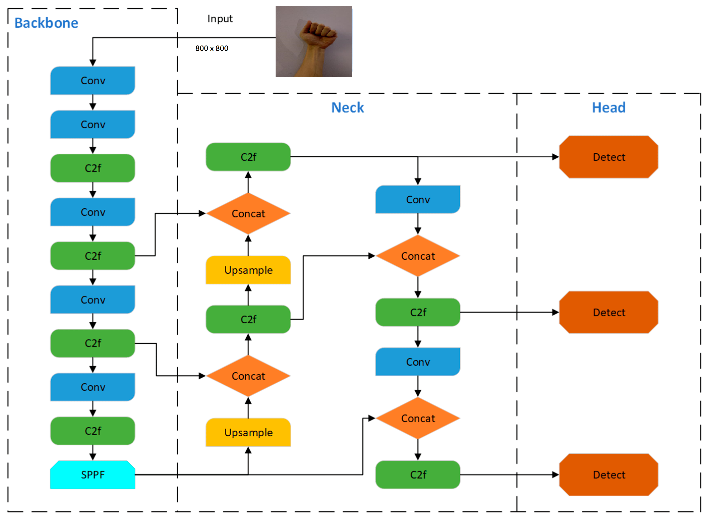
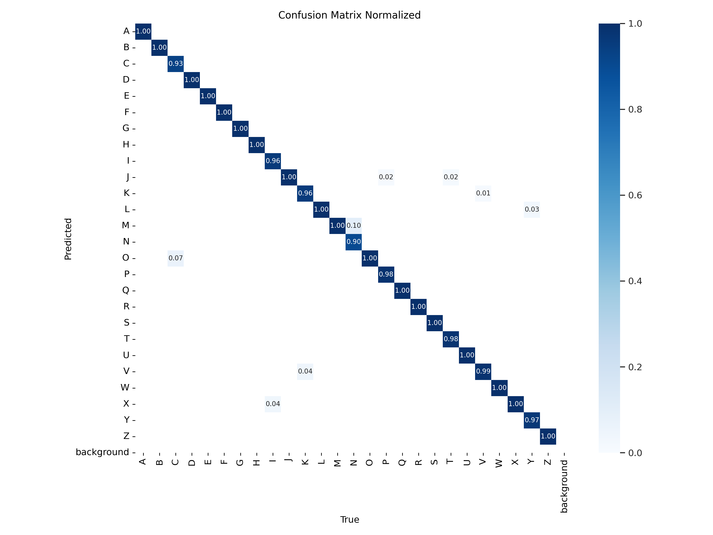
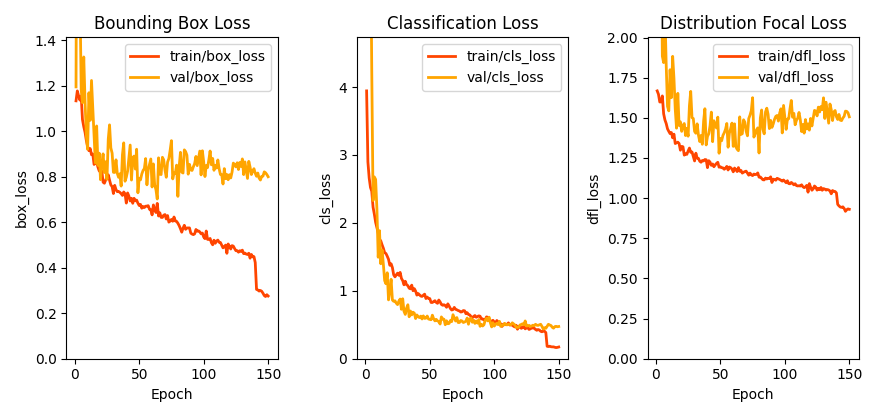
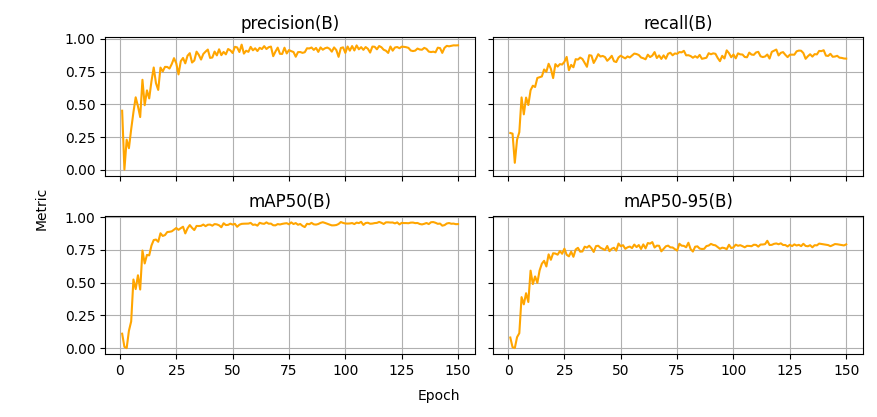

### 1 研究動機

根據世界聾人聯盟（World Federation of the Deaf, WFD）調查，全球有超過7千萬名聽障者，使用300種以上不同的手語，依照區域、文化的不同，衍生發展各自的手語系統，甚至也有同一地區內部所產生的變體，除此之外，聽障者群體也發展一套可跨國交流的國際手語，顯現全球手語系統的多樣性。[^1]

在全球手語系統多樣性的背景下，台灣手語（Taiwan Sign Language, TSL）展現了其獨特的歷史與文化演變。台灣手語的發展始於日治時期，受日本手語影響逐步形成，並在台灣北、中、南地區形成了不同的方言。隨著社會對手語和聾人文化的重視，台灣手語現已成為台灣的國家語言之一。然而，儘管台灣擁有約12.5萬名聽障人士，實際使用台灣手語的人數卻僅有2至3萬人。這一現象的原因在於學習成本過高以及使用效率低下。

隨著科技的發展，我們看到科技應用在語言學習領域的巨大潛力，尤其是手語的辨識和翻譯技術。然而，在將科技引入台灣手語學習的過程中，我們同樣遇到了瓶頸，例如：台灣手語的翻譯服務供不應求、語料庫與語言模型相對匱乏，現有的手語辨識與翻譯服務的近用性（accessibility）也不足，這些問題使我們必須重新思考技術的可行性與應用場景。

因此，我們團隊決定採取一個更為漸進的策略。由於台灣手語資源的稀缺性和開發難度，我們選擇從技術相對成熟且資源豐富的ASL（American Sign Language，美國手語）字母辨識入手，作為我們的初階產品。這一選擇有其多重考量，首先，ASL作為國際間最為普及的手語之一，擁有廣泛的學習資源和應用基礎。開發ASL字母辨識工具不僅有助於我們團隊熟悉手語辨識技術，還能為未來台灣手語的開發奠定技術基礎。其次，透過選擇技術成熟的ASL作為起點，我們可以在較短時間內開發出可行的產品，並在技術上達到一定水準。這樣的過程將為未來擴展至台灣手語的開發累積寶貴經驗。

### 2 模型應用與技術參考

手語辨識目前是一個活躍的研究領域，已經有許多專案和開源資源可以參考。在 Kaggle、Hugging Face 和 GitHub 等平台上，有許多研究者和開發者分享了他們的手語辨識模型和程式碼。此外，Google 也曾利用 MediaPipe 進行過美國手語（ASL）辨識的競賽。這些資源涵蓋了各種手語語言的資料集和模型，為其他開發者提供了寶貴的參考和基礎。

在本研究中，我們主要參考了現有的手語辨識模型和相關技術，並基於這些技術進行了應用與改進。由於時間與資源限制，我們未進行廣泛的文獻回顧，而是著重於實踐中高效且被證明有效的技術方案。這些參考模型的選擇是基於它們在相關研究中的成功應用，並結合我們的需求進行了具體的調整與優化，以確保在有限的時間和資源內達到預期的辨識效果。以下為本專案所參考的模型應用與技術：

1. Sign Language on Hugging Face[^2]
這個專案專注於使用深度學習模型來辨識美國手語（ASL）。該模型基於 PyTorch 架構，並整合到 Hugging Face 生態系統中。專案展示了如何使用圖像分類器進行手語辨識。根據自我報告，該模型的準確率達到 100%。專案中提供了 ASL 字母的範例圖像，以展示模型的功能。然而，由於該模型目前缺乏足夠的活動，尚無法部署在 Hugging Face 的推理 API 上。

2. ASL Fingerspelling Recognition with TensorFlow[^3]
此 Kaggle 專案由 Gusthema 提出，展示了如何使用 TensorFlow 來辨識美國手語（ASL）的手指拼字。該模型利用卷積神經網絡（CNN）處理 ASL 字母的圖像並進行分類。所使用的數據集非常全面，包含每個 ASL 字母對應的手勢圖像。專案結構完整，從數據預處理到模型訓練和評估，提供了 TensorFlow 在 ASL 辨識任務中的有效應用實例。

3. Sign Language Alphabets Detection and Recognition using YOLOv8[^4]
MuhammadMoinFaisal 的這個 GitHub 專案著重於使用 YOLOv8 模型來檢測和辨識手語字母。YOLOv8 以其在物體檢測任務中的速度和精確度而著稱，在此應用於識別和分類對應於字母的手勢。專案提供了詳細的文檔，涵蓋了模型的設置、使用自定義數據集進行訓練，以及部署模型進行實時辨識的過程。使用 YOLOv8 在需要快速且精準檢測的場景中具有優勢，使其適合於實時應用如手語翻譯。

4. Action Detection for Sign Language[^5]
nickNochnack 的 GitHub 專案提供了一種獨特的手語辨識方法，專注於動作檢測。該專案利用深度學習模型，不僅能辨識靜態手語，還能檢測構成手語交流基礎的動作。該模型能夠實時檢測各種手語手勢，這對於需要辨識動態手語的情境特別有用，因為動作和手勢與靜態手語一樣重要。專案包括了設置環境、訓練模型和部署模型進行實時檢測的教程。

本專案的限制在於時間有限，無法進行深入的模型開發和優化。此外，由於此專案只是初步應用，因此在選擇模型時，優先考慮那些能夠快速達到成果的方案。基於這些考量，我們最終選擇了 Muhammad Moin Faisal 的模型。該模型基於 YOLOv8，能夠提供快速且準確的手語字母辨識，這使其成為在短時間內達到預期目標的最佳選擇。

### 3 模型技術說明

#### 3-1 模型訓練環境 Kaggle

Kaggle 提供了一個高度整合的資料科學平台，擁有資料集、Notebook 環境以及計算加速裝置，如 GPU 和 TPU，讓資料科學家可以輕鬆進行模型訓練和測試。本專案選擇在 Kaggle 平台上訓練模型，利用其雲端環境和豐富的 GPU 資源來管理大型資料集和模型訓練過程。為了加速訓練並提高計算效率，我們使用了兩個 Tesla T4 GPU 進行並行計算，這種雙 GPU 配置能夠有效處理 YOLO 模型在訓練過程中所需的大量計算和記憶體資源，特別適合於物件偵測任務。

#### 3-2 Roboflow平台與資料集

Roboflow 提供了強大的電腦視覺工具，支持資料集管理、標註、增強和模型部署，用戶可以有效率地進行圖像標註和增強。因此，本專案採用 Roboflow 平台來準備資料集，再透過API下載資料集至 Kaggle 平台，使用自定義的配置檔案來指定訓練和驗證資料的位置，以及模型應學習的類別標籤，為模型提供訓練的基礎。

本專案採用的資料係參考 `david-lee-d0rhs` 在 Roboflow 所提供的資料集[^6]，主要圖像共720張，其中訓練集為504張（70%），驗證集144張（20%），以及測試集72張（10%）。除此資料集之外，又於該平台蒐集ASL字母圖像至16,993張，並將擴增之資料集再度投入訓練，以取得最佳成果。

#### 3-3 YOLO模型特色/選擇原因

YOLO (You Only Look Once) 是一種基於深度學習的高效物件偵測技術，其核心特色在於只需一次前向傳播（forward pass）即可識別圖像中的所有物體及其位置。這種設計使得 YOLO 特別適合需要低延遲的應用場景，如自動駕駛和監控系統。

YOLO 的發展始於 2015 年，由 Joseph Redmon 首次提出。初代 YOLO v1 引入了即時物件偵測的概念，雖然速度快，但在小物件偵測上仍有局限。隨後的 YOLO v2 和 YOLO v3 逐步改善了小物件偵測能力和模型的準確性，並引入了多尺度預測架構，平衡了速度與準確性。2020 年，YOLO v4 由台灣學者王健堯及其團隊與俄羅斯學者 Alexey 共同開發，通過新增骨幹網絡和特徵提取技術，顯著提升了模型性能。

YOLOv8 作為最新版本，在技術上進行了多項改進，特別針對邊緣裝置進行了優化。其主要特色包括無錨檢測技術（Anchor Free Detection），減少了模型的計算負擔，提高了推理速度。此外，YOLOv8 引入了新的卷積層設計，進一步增強了特徵提取和信息融合能力。這些改進使 YOLOv8 能夠在更多樣化的環境中運行，尤其是在邊緣裝置上表現出色，適用於影像分類、物件偵測、實例分割等多種 AI 視覺任務。

由於字母手語辨識涉及手型的辨識與分類，對於偵測精準度有較高的需求，此外也需考量辨識的即時性，在此限制之下，鑒於YOLO在單一神經網路模型中同時完成物件檢測和分類的特性，以及即時處理影像的速度，本專案係採用YOLO v8 Large為開發字母手語辨識功能之核心技術。

YOLO 提供多種模式來應對不同的影像任務需求，針對手語辨識的功能開發，在需要對手型進行快速識別與定位的情況下，我們選擇了YOLO提供的物件偵測（`task=detect`）功能，從影像中檢測並標註手部的邊界框與類別標籤。為了進一步優化模型，我們也使用了 YOLO 的分類 (`task=classify`) 功能，將任務重點放在手型的分類上，這有助於提高辨識的準確度，並使我們能更有效地區分不同手語字母或手勢。這種方式讓我們可以在不同的任務需求下靈活應用 YOLO 的特性，從而達到最佳的辨識效果。

[^7]

#### 3-4 訓練的參數設定

在 YOLO 模型的訓練中，選擇了 YOLOv8 large（`yolov8l.pt`）作為預訓練模型，這一版本在準確性和資源需求之間取得了平衡。訓練任務設為物件偵測，目的是識別影像中的拼字邊界框並進行標註。訓練過程共進行了 50 個週期（epoch），以便模型能充分學習手語的特徵，並透過多次迭代來優化其參數。

批次大小（batch size）設為 32，這有助於在訓練中維持穩定的梯度估計，同時避免超過 GPU 的記憶體限制，從而在訓練速度和資源使用之間取得平衡。影像尺寸則設定為 800 像素，旨在保留足夠的圖像細節，同時控制計算負擔，以提高模型在偵測不同大小手語字母時的效能。

為了確保最佳的優化效果，訓練過程中使用了自動優化功能，通常會選擇如 AdamW 等在深度學習任務中表現出色的優化器。這些設定的綜合應用旨在提升模型的準確度與穩定性，為後續的模型評估和應用提供可靠的基礎。

#### 3-5 模型評估指標

在我們訓練的最終結果（第 150 個 epoch，總共 150 個 epoch）中，模型的損失函數包括邊界框回歸損失（`box_loss`）、分類損失（`cls_loss`）和分佈焦點損失（`dfl_loss`），這些損失分別為 0.3927、0.2505 和 1.024。這些數值表明模型在預測物件邊界框、類別以及邊界框精確度方面的誤差，損失值越低，表示模型預測越接近真實值。

性能指標方面，我們的模型在精確率（Precision, $P$）上達到了 0.953，意味著預測的物件中有 95.3% 是正確的；召回率（Recall, $R$）為 0.868，表示實際存在的物件中有 86.8% 被正確檢測到。此外，平均精度 `mAP50` 為 0.959，`mAP50-95` 為 0.803，這些數值反映了模型在不同 IoU（Intersection over Union）門檻下的檢測精度。總體來說，這些數據表明我們的模型具有甚高的準確性和穩定性。

### 4 Web框架與部署

本專案使用Django作為前後端框架，開發了具備Wordle遊戲、字母手語教學及影像辨識等功能的互動網頁應用，並實現會員系統及排名功能。應用程序在Google Cloud Platform（GCP）上部署，使用Apache伺服器、mod_wsgi模組和Let’s Encrypt的HTTPS憑證，確保應用的安全性和功能性，提供加密通訊以保障使用者隱私。

#### 4-1 Django

本專案以Django作為前後端框架的基礎，開發了具有多項功能的網頁應用系統，涵蓋Wordle遊戲、字母手語教學、會員系統和遊戲排名功能，並結合影像辨識技術，提供了互動式的學習和遊戲體驗。後端部分利用Django的ORM進行資料庫操作和業務邏輯處理，並通過Django REST Framework實現了RESTful API，支持JSON格式的數據傳輸，使前端能夠靈活地進行資料交換。以上即為本專案基於Django框架的架構說明。

##### 4-1-1 上傳圖片、辨識API

在這個手語辨識的過程中，前端客戶端透過網頁開啟攝影機來擷取手語的手型，並將圖像上傳到伺服器。伺服器接收到圖像後，會先進行色彩和翻轉的資料處理，然後將處理過的圖像發送至模型進行辨識。如果上傳成功，模型會返回辨識結果給伺服器，伺服器再將結果回傳給前端客戶端，透過Wordle模式或教學模式與使用者互動。如果上傳失敗，伺服器則會將錯誤訊息返回給客戶端。

##### 4-1-2 註冊登入API

當前端客戶端使用POST方法發送註冊請求時，伺服器首先查詢使用者資料。如果使用者已存在，伺服器會返回錯誤訊息。如果使用者不存在，伺服器會創建新帳號，生成新的token，並記錄登入時間。token用於身份驗證和會話管理，確保每次請求都能確認使用者身份並維持會話狀態。伺服器會將註冊成功的訊息、token和登入時間返回給客戶端。

對於登入請求，伺服器會查詢使用者資料。如果使用者存在，伺服器會檢查密碼是否正確。若密碼正確，伺服器會更新登入時間，生成新的token，並將登入成功的訊息、token和登入時間返回給客戶端。客戶端會將登入狀態儲存到sessionStorage。若密碼錯誤或使用者不存在，伺服器會返回相應的錯誤訊息。

##### 4-1-3 提交遊戲成績API

當客戶端發送遊戲結果時，首先從網址列獲取`userid`，並從網頁的sessionStorage取得token。然後，客戶端使用POST方法將`userid`、遊戲分數和token發送至伺服器。伺服器接收到請求後，查詢使用者資料。如果使用者存在，伺服器會檢查token是否正確。如果token正確，伺服器會更新該使用者的總分數，並返回成功訊息給客戶端。如果token錯誤，伺服器會返回錯誤訊息。如果使用者不存在，伺服器會返回使用者不存在的錯誤訊息。

##### 4-1-4 排名API

對於用戶排名查詢，客戶端使用GET方法發送包含`userid`的請求至伺服器。伺服器會查詢該使用者的資料。如果使用者存在，伺服器會進一步查詢所有使用者的總分數，按分數排序，並返回包括排名、分數、使用者數量以及前三名使用者的資料。如果使用者不存在，伺服器會返回無此使用者的錯誤訊息。

#### 4-2 GCP 部署

為了在 Google Cloud Platform（GCP）上部署我們的 Web App，我們首先創建了名為 `slgame` 的專案，並在 Google Compute Engine 上配置了一個虛擬機器（VM）執行個體 `swordle-vm0`。此 VM 使用 e2-small 類型，包含 1 vCPU 和 2 GB 記憶體，並設置了 30 GB 的已平衡永久硬碟，運行 Ubuntu 22.04 作業系統。安裝完成後，我們部署了 Apache 伺服器和所需的 Python 環境，並使用 `mod_wsgi` 模組來支持 Django 框架的 Web 服務。為了確保 Web App 的安全性和功能性，尤其是為了讓瀏覽器可以安全存取視訊攝影機，我們使用 Let’s Encrypt 申請了 HTTPS 憑證，並配置了 Apache 虛擬主機以支援 HTTPS 連接。而且所有的 HTTP 請求均被配置為永久重定向至 HTTPS，以提供加密通訊，保障使用者的隱私。

##### 虛擬機器規格表

| 項目                | 規格描述                                         |
|---------------------|------------------------------------------------|
| 虛擬機器名稱         | swordle-vm0                                     |
| 虛擬機器類型         | e2-small                                        |
| CPU 平台            | Intel Broadwell                                |
| 架構                | x86/64                                          |
| 處理器              | 1 vCPU                                          |
| 記憶體              | 2 GB                                            |
| 儲存空間            | 30 GB 已平衡永久磁碟                             |
| 作業系統            | Ubuntu 22.04 LTS (Jammy Jellyfish)             |
| IP 位址             | 靜態 IPv4 (`35.221.146.182`)                    |
| HTTPS 支援          | 已啟用（使用 Let’s Encrypt 憑證）                |
| Apache 模組         | 安裝 mod_wsgi，支援 Django 框架                 |
| 防火牆設定          | 啟用 HTTP 和 HTTPS 流量，允許外部訪問          |

### 5 使用者體驗

本專案的網頁介面設計基於 HTML、CSS 和 JavaScript 三項核心技術，全面提升系統功能和使用者體驗。專案中包含兩種模式：教學模式和 Wordle 模式，以促進手語學習和娛樂的有效結合。

教學模式旨在協助使用者掌握英文字母的手語表達。使用者可選擇字母，系統將展示該字母的手語圖像及說明，並即時提供手語識別結果及準確度評估，以助使用者調整並改進其手語技巧，為 Wordle 模式奠定堅實的學習基礎。

Wordle 模式融合手語識別與單字猜測遊戲，創造挑戰性和互動性的學習環境。玩家須根據系統反饋逐步推測單字，系統提供手語識別結果及準確度，以便玩家檢查手語表達。提示顏色包括綠色（字母正確且位置正確）、黃色（字母正確但位置錯誤）和灰色（字母不在單字中）。註冊並登入玩家的遊戲成績將根據猜測所需的嘗試次數進行計算，並顯示於排行榜上。Wordle 模式旨在通過手語識別挑戰提升英文字母手語掌握，增強學習的互動性和趣味性。

### 6 展望

目前的專案專注於美國手語（ASL）的應用，並已成功將模型辨識技術與遊戲開發結合。在這一階段，我們掌握了手語辨識的基礎技術。通過在 Kaggle 平台上使用 YOLOv8 訓練出的 ASL 字母辨識模型，團隊將其整合至 Django REST Framework 的 API 中，建立了一個美國手語拼字遊戲網站。這一成果為未來發展台灣手語辨識系統應用提供了初步的基礎。

展望未來，基於台灣手語（TSL）的獨特性，我們有幾個值得探索的發展方向。例如，逐步建立 TSL 語料庫，並結合深度學習技術，開發出能夠辨識和翻譯 TSL 詞彙的系統。我們期望本專案的延續能為未來台灣聽障人士提供一個更具實用性和無障礙的溝通平台。

### 7 參考資料

[^1]: National Geographic, "Sign Language," [Online]. Available: https://education.nationalgeographic.org/resource/sign-language/. [Accessed: 31-Aug-2024].

[^2]: *RavenOnur*, "Sign Language," Hugging Face, [Online]. Available: https://huggingface.co/RavenOnur/Sign-Language. [Accessed: 31-Aug-2024].

[^3]: *gusthema*, "ASL Fingerspelling Recognition with TensorFlow," Kaggle, [Online]. Available: https://www.kaggle.com/code/gusthema/asl-fingerspelling-recognition-w-tensorflow. [Accessed: 31-Aug-2024].

[^4]: *MuhammadMoinFaisal*, "Sign Language Alphabets Detection and Recognition using YOLOv8," GitHub, [Online]. Available: https://github.com/MuhammadMoinFaisal/Sign-Language-Alphabets-Detection-and-Recongition-using-YOLOv8. [Accessed: 31-Aug-2024].

[^5]: *nicknochnack*, "Action Detection for Sign Language," GitHub, [Online]. Available: https://github.com/nicknochnack/ActionDetectionforSignLanguage. [Accessed: 31-Aug-2024].

[^6]: *david-lee-d0rhs*, "American Sign Language Letters," Roboflow Universe, [Online]. Available: https://universe.roboflow.com/david-lee-d0rhs/american-sign-language-letters. [Accessed: 31-Aug-2024].

[^7]: X. Zhai, Z. Huang, T. Li, H. Liu, and S. Wang, "YOLO-Drone: An Optimized YOLOv8 Network for Tiny UAV Object Detection," *Electronics*, vol. 12, no. 17, p. 3664, Aug. 2023. Available: https://www.mdpi.com/2079-9292/12/17/3664.
